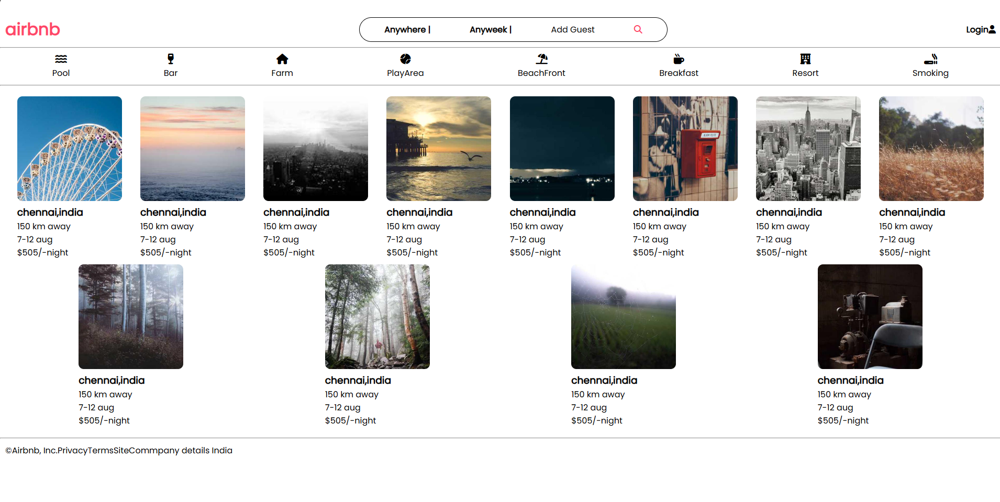

# Airbnb Landing Page Clone

A simple Airbnb landing page clone built with HTML and CSS. This project demonstrates a clean, responsive UI inspired by Airbnb, featuring a search bar, filter icons, and property cards.

## Features
- Responsive header with logo, search bar, and login
- Filter section with icons (Pool, Bar, Farm, PlayArea, BeachFront, Breakfast, Resort, Smoking)
- Property cards with images, location, distance, date, and price
- Simple, modern design using the Poppins font and Font Awesome icons
- Footer with company details

## Tech Stack
- HTML5
- CSS3 (Flexbox)
- [Font Awesome](https://fontawesome.com/) for icons
- [Google Fonts - Poppins](https://fonts.google.com/specimen/Poppins)

## Setup & Usage
1. **Clone or download this repository.**
2. **Open `index.html` in your web browser.**
   - No build step or server is required; this is a static project.
3. **(Optional) Edit `index.html` or `style.css` to customize the content or styles.**

## Credits
- Images are loaded from [Picsum Photos](https://picsum.photos/)

---

© Airbnb, Inc. (This is a demo project for educational purposes only.) 