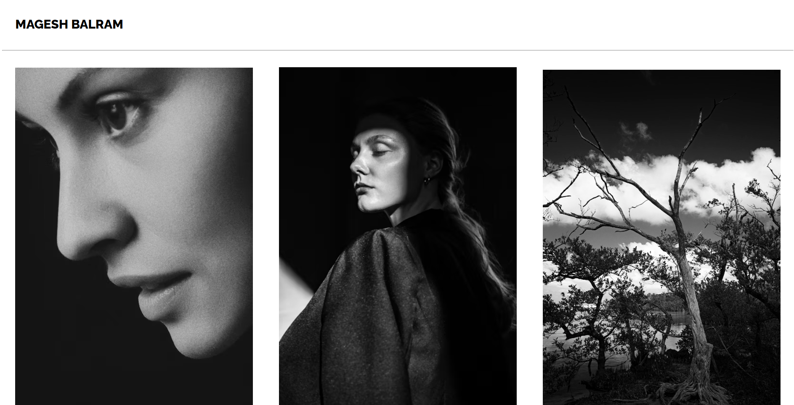

# Photo Gallery

A simple, elegant photo gallery web page showcasing a collection of beautiful images. This project demonstrates basic HTML and CSS skills, focusing on layout, typography, and responsive design.

## Features
- Clean and modern design
- Responsive image grid (images scale to 30% width with spacing)
- Custom navigation bar with author name (Magesh balram)
- Uses Google Fonts (Raleway)
- Easy to customize with your own images

## Getting Started
1. **Clone or download this repository.**
2. Open `photo site.html` in your web browser to view the gallery.

## File Structure
- `photo site.html` – Main HTML file for the gallery
- `photo.css` – CSS styles for layout and typography
- `image.png` – Preview image of the gallery (see above)

## Customization
- To use your own images, replace the `` URLs in `photo site.html` with your own image links.
- Adjust styles in `photo.css` to change the layout or appearance.

## Author
Magesh balram

---

*This project is a simple static site and requires no build tools or dependencies.* 