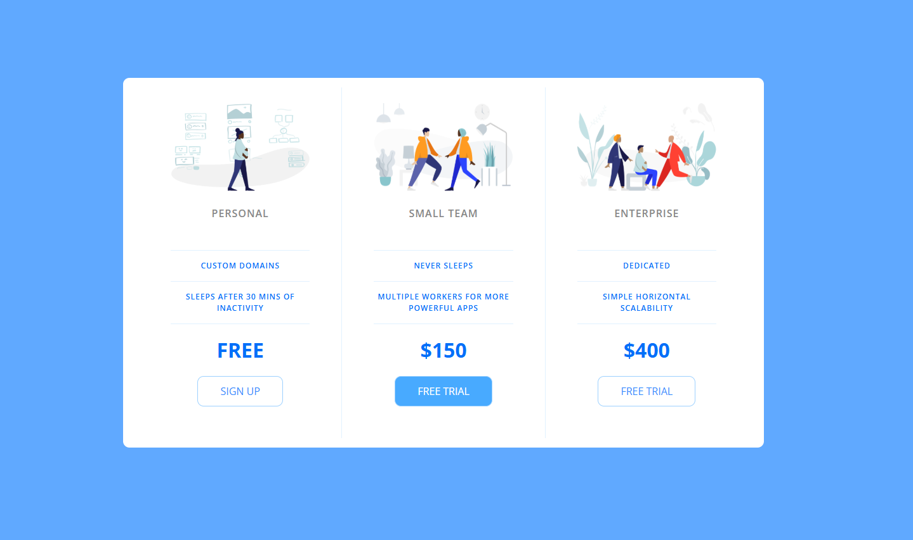

# PricingPanel

A modern, responsive pricing panel built with HTML and CSS. This project displays three pricing tiers—Personal, Small Team, and Enterprise—each with its own features, price, and call-to-action button. The design is clean, mobile-friendly, and easy to customize for your own SaaS or product landing page.

## Features

- **Three pricing tiers:** Personal (Free), Small Team ($150), and Enterprise ($400)
- **Feature highlights:** Each plan lists its unique features
- **Responsive design:** Looks great on both desktop and mobile
- **Modern UI:** Uses Google Fonts and custom icons for a professional look
- **Easy to customize:** Change colors, icons, and text in HTML/CSS

## Preview

See the screenshot above (`image.png`) for a visual preview of the pricing panel.

## Getting Started

1. **Clone or download this repository**
2. Open `index.html` in your browser

No build tools or dependencies are required—everything runs in the browser.

## File Structure

- `index.html` – Main HTML file
- `app.css` – Stylesheet for layout and design
- `icons/` – Custom icons for each pricing tier
- `image.png` – Preview screenshot for README

## Customization

- **Change plan names, features, or prices:** Edit the relevant sections in `index.html`
- **Update icons:** Replace the images in the `icons/` folder
- **Adjust colors or layout:** Modify `app.css` as needed

## License

This project is open source and available under the [MIT License](LICENSE) (add a LICENSE file if you wish to specify one). 