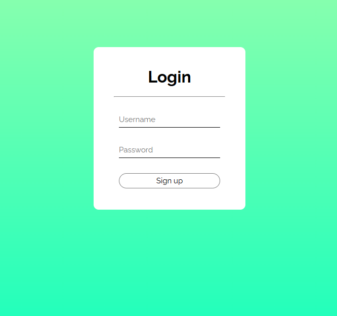

# Registration Green

This project is a simple frontend registration page. It includes an HTML file (`index.html`), a CSS file for styling (`style.css`), and a preview image (`image.png`).

## Project Structure
- `index.html`: Main HTML file for the registration page.
- `style.css`: Stylesheet for the registration page.
- `image.png`: Preview image of the registration page.

## Usage
1. Clone or download this repository.
2. Open `index.html` in your web browser to view the registration page.

## Preview

 